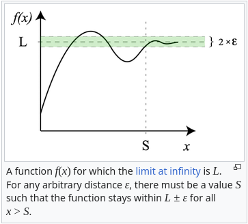

# The bible

A collection of ALL symbols, definitions and theorems we ever needed and will need, as dumbed down and concentrated as they can get.

## The symbols

### Sets
|Symbol|Description|Symbol|Description|
|:-:|:-|:-:|:-|
|$\mathbb{N}$|Set of natural numbers|$\mathbb{Z}$|Set of integer numbers|
|$\mathbb{Q}$|Set of fractional numbers|$\mathbb{R}$|Set of real numbers|
|$\mathbb{C}$|Set of complex numbers|$\varnothing$|Empty set|

### Operations between sets
|Symbol|Description|Symbol|Description|
|:-:|:-|:-:|:-|
|$\cup$|Union|$\cap$|Intersection|
|$\setminus$|Difference|$A^c$|Complement (of the set A in this case)|

### Relation operators
|Symbol|Description|Symbol|Description|
|:-:|:-|:-:|:-|
|$\subset$|Proper subset of|$\not\subset$|Not a proper subset of|
|$\subseteq$|Subset of|$\not\subseteq$|Not a subset of|
|$\in$|Is part of the set|$\not\in$|Not part of the set|

### Logic
|Symbol|Description|Symbol|Description|
|:-:|:-|:-:|:-|
|$\forall$|For every|$\exists$|Exists at least one|
|$\exists!$|Exists a unique|$\nexists$|Doesn't exist|
|$\lor$|Vel / or|$\land$|Et / and|

## The definitions
### Limits
A limit is the value that a function (or sequence) approaches as the argument approaches some value. It may not be equal to the value of that function at the value of the argument.  
For example, if at the value specified the function suddently jumps to a value of $a$ but approaching it indicates a value of $b$, the value of the limit is $b$.  
Also, if the function is not continuous at a given value, the limit in that spot does not exist, as approaching from two different sides yields two different results.

There are four different mathematical definitions that we use to describe limits that have infinity as both the value x is approaching and the result:  
$\lim_{x\to+\infty}f(x)=+\infty\iff\forall M\in\mathbb{R}\exists x_0\mid\forall x\gt x_0\ f(x)\gt M $  
$\lim_{x\to+\infty}f(x)=-\infty\iff\forall M\in\mathbb{R}\exists x_0\mid\forall x\gt x_0\ f(x)\lt M $  
$\lim_{x\to-\infty}f(x)=+\infty\iff\forall M\in\mathbb{R}\exists x_0\mid\forall x\lt x_0\ f(x)\gt M $  
$\lim_{x\to-\infty}f(x)=-\infty\iff\forall M\in\mathbb{R}\exists x_0\mid\forall x\lt x_0\ f(x)\lt M $

